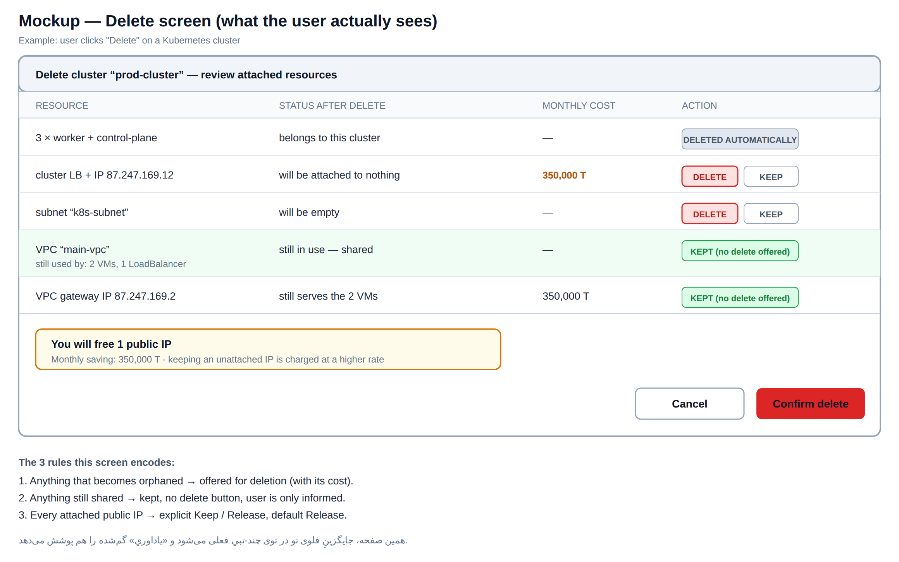
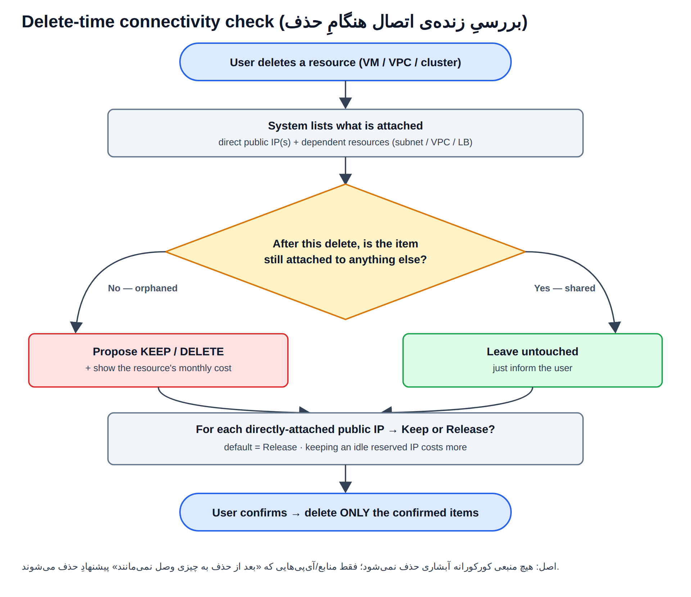

# راهکار

**خلاصه در یک خط:** دو تغییرِ اصلی — در **فلوی ساخت** آی‌پیِ اضافه به کاربر تحمیل نشود، و در **فلوی حذف** آی‌پیِ بی‌استفاده جا نماند.

## جدولِ خلاصه — چه چیزی عوض می‌شود

| # | الان چیست | چه بشود | کدام مشکل را حل می‌کند |
|---|---|---|---|
| ۱ | کاربر هم‌زمان می‌تواند به VPC آی‌پی بدهد و هم به VM → دو آی‌پی | **یک سؤالِ واحد:** «این ماشین چطور به اینترنت وصل شود؟» با ۳ گزینه‌ی هزینه‌دار | بیش‌خرید در ساخت |
| ۲ | انتخابِ رزرو/موقتی در زمانِ **ساخت** | این انتخاب **حذف شود**؛ فقط در زمانِ **حذف** بپرسیم «نگه یا آزاد؟» | رزروِ محافظه‌کارانه (۱۴۱ آی‌پی) |
| ۳ | پیش‌فرض = ساختِ آی‌پیِ **جدید** + اتصال به اینترنت | پیش‌فرض = **انتخاب از آی‌پی‌های موجود**، اتصال غیرپیش‌فرض | بیش‌خرید در ساخت |
| ۴ | آی‌پیِ LBِ کوبر پیش‌فرض **رزرو** | پیش‌فرض **موقتی** شود | ۶۴ آی‌پیِ `ske-` |
| ۵ | با حذفِ ریسورس، آی‌پیِ رزرو بی‌صدا می‌ماند و **یاداوری نمی‌شود** | **صفحه‌ی مرورِ حذف** (بخش ۲) | حالت ۱ — ۲۰۵ آی‌پی |
| ۶ | حذفِ VPC/کلاستر تو در تو و چند-تبی؛ subnet+VPC+IP جا می‌مانند | همان صفحه‌ی مرور + دکمه‌ی حذفِ درجا | حالت ۲ — ۹۷ آی‌پی |
| ۷ | باگ‌ها: LBِ نصفه، پیامِ خطای رنجِ تمام‌شده | فیکس | آی‌پیِ یتیمِ جدید |

## ۱) فلوی ساخت — یک سؤال به‌جای دو تیک

به‌جای اینکه کاربر جدا برای VPC و جدا برای VM تیک بزند، **یک سؤال**: «این ماشین چطور به اینترنت وصل شود؟»

| گزینه | مصرفِ آی‌پی | مناسبِ چه کسی |
|---|---|---|
| **فقط خروجی — از گیت‌ویِ VPC** ← پیش‌فرض | **۰** آی‌پیِ اضافه | اپ‌سرور، ورکر، دیتابیس، جاب |
| **ورودی از طریق LoadBalancer** | **۱** آی‌پی برای چند VM | سرویسی که باید از بیرون دیده شود |
| **آی‌پیِ اختصاصی روی VM** | **۱** آی‌پی به‌ازای هر VM | VPN، whitelist، میل‌سرور |

- اگر کاربر هم آی‌پیِ VM بزند هم گیت‌ویِ VPC → هشدار: «برای خروجی هر دو لازم نیست».
- هزینه‌ی ماهانه زنده کنارِ انتخاب نشان داده شود.
- **کانسپتِ رزرو/موقتی از این صفحه کاملاً حذف شود.**

## ۲) فلوی حذف — صفحه‌ی مرور با «بررسیِ زنده‌ی اتصال»

**قانون:** نه حذفِ کورکورانه (چون VPC ممکن است مشترک باشد)، نه جاماندنِ بی‌صدا. سیستم همان لحظه چک می‌کند هر منبع **بعد از این حذف orphan می‌شود یا مشترک می‌ماند**.

**سه قانونی که این صفحه پیاده می‌کند:**
1. هرچه orphan می‌شود → پیشنهادِ حذف، همراهِ **هزینه‌ی ماهانه‌اش**.
2. هرچه هنوز مشترک است → نگه داشته می‌شود، **دکمه‌ی حذف داده نمی‌شود**، فقط اطلاع.
3. هر آی‌پیِ پابلیکِ متصل → **«نگه یا آزاد؟»** با پیش‌فرضِ **آزاد** (+ یادآوریِ اینکه آی‌پیِ بی‌اتصال گران‌تر است).

**همین یک صفحه، برای هر چهار فلو استفاده می‌شود:**

| کاربر چه را حذف می‌کند | سیستم چه پیشنهاد می‌دهد |
|---|---|
| **ماشین مجازی** | آی‌پیِ خودش → نگه/آزاد · اگر subnet/VPC خالی می‌شود → پیشنهادِ حذف؛ اگر مشترک است → فقط اطلاع |
| **کلاستر کوبر** | worker/control-plane و LB → خودکار · VPC/subnet و آی‌پی: فقط اگر بعدش به چیزی وصل نمی‌مانند → پیشنهادِ حذف |
| **VPC** | subnetها، ماشین‌ها، LBها و آی‌پی‌ها با هزینه و دکمه‌ی حذفِ درجا (جایگزینِ فلوی چند-تبی) |
| **LoadBalancer** | آی‌پیِ متصل → نگه/آزاد |

## ۳) بازپس‌گیریِ موجودیِ فعلی

| دسته | تعداد | اقدام |
|---|---|---|
| کوبر (`ske-`) + تستی | ۶۴ + ۱۷ | سیستمی و بی‌ریسک — بدونِ دخالتِ کاربر آزاد شوند |
| بی‌اتصالِ non-ske | ۱۴۱ | نوتیف به مشتری (شروع از بزرگ‌ترین‌ها) |
| VPCهای بدونِ سرور | ۹۷ | بعد از تأییدِ نبودِ ترافیک |

**فاز بعد:** قیمتِ گران‌ترِ آی‌پیِ رزروِ بی‌اتصال + TTL و حذفِ خودکار با هشدار.
